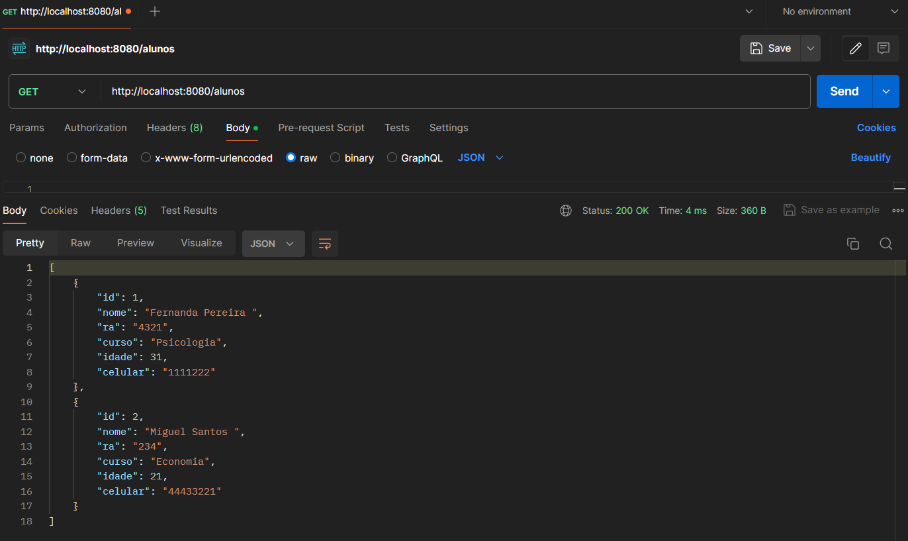

# AC1 Arquitetura WEb
## Exercício - Aula 03

### Classe AlunoController.java

### Interface AlunoService.java

### Classe AlunoServiceImpl.java

### Interface AlunoRepository.java

### Classe AlunoRepositoryImpl.java

# Api - Postman
## CRUDS

### Get

### Get por Id

### Post

### Put

### Delete

